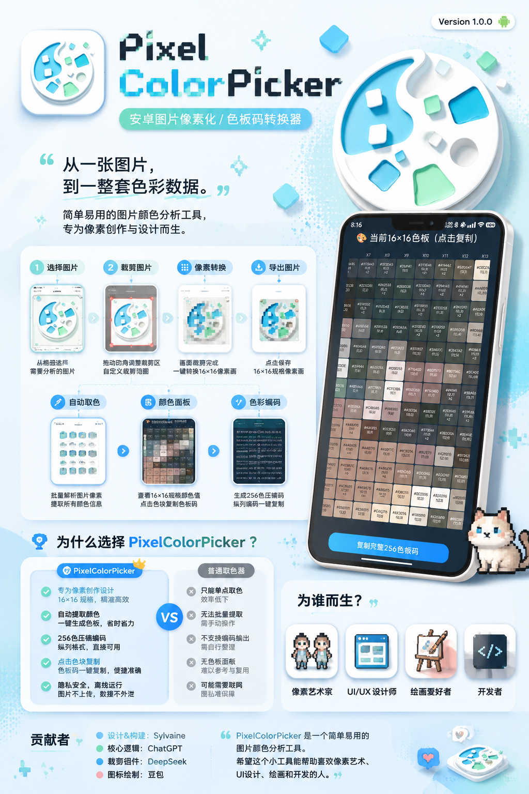
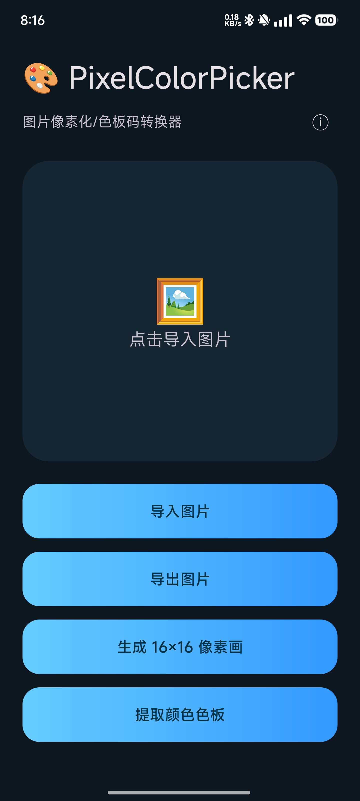
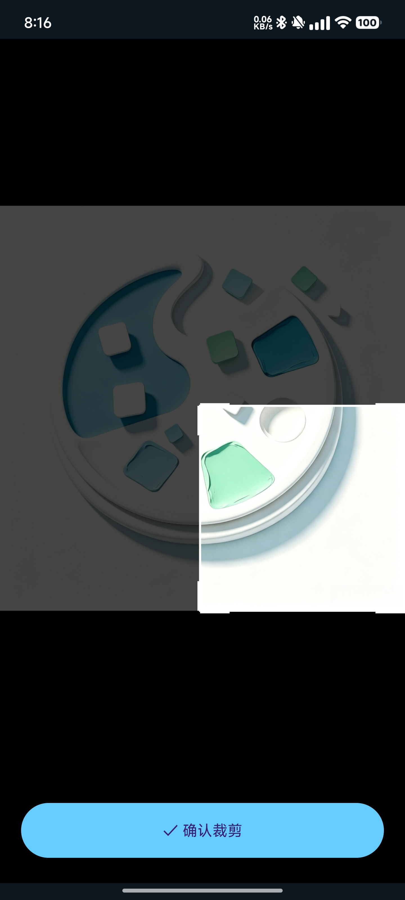
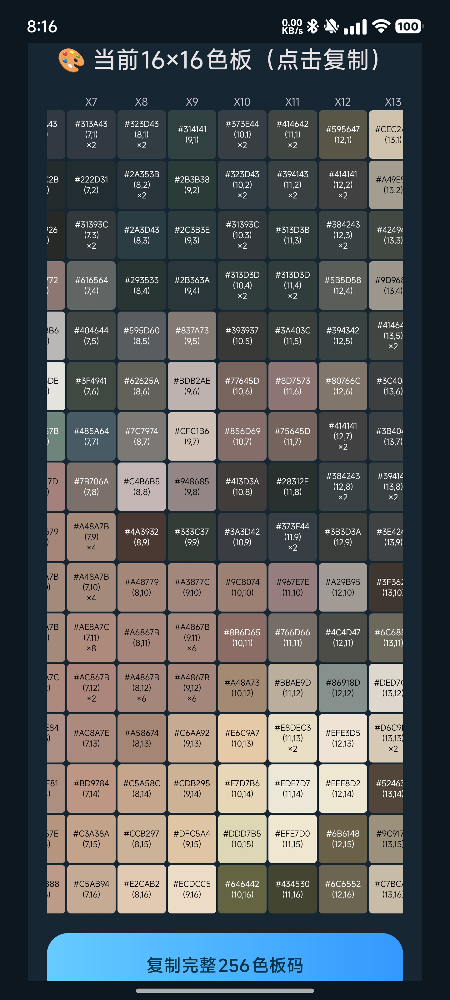

  

<h1 align="center">
PixelColorPicker
</h1>

Android 图片像素化 / 色板码转换工具

---

## ✨ 简介

PixelColorPicker 是一款简单易用的 Android 图片处理工具。

它可以将普通图片转换为像素化图像，并自动分析图片颜色，生成对应色板数据。

主要用于：

- 🎮 游戏贴图制作
- 🎨 像素艺术创作
- 🌈 图片颜色分析

---

# 🚀 功能特性

## 🖼️ 图片选择

从相册选择需要处理的图片。

支持常见图片格式。

## ✂️ 自定义裁剪

自由调整图片裁剪区域。

精准选择需要转换的画面范围。

## 🎨 像素化处理

- 图片转换为 16×16 像素图
- 自动分析颜色信息
- 保留主要视觉特征

## 🌈 色板提取

自动提取图片主要颜色。

生成对应颜色数据。

## 📋 数据导出

生成可复制的色板码数据。

方便用于游戏以及像素创作。

---

# 📱 应用截图

---

# 🛠️ 技术实现

- Java
- Android SDK
- Bitmap 图像处理
- 像素采样算法
- Protobuf 数据编码
- GZIP 压缩

---

# 👨‍💻 Credits

- Design & Development: Sylvaine
- Core Algorithm Assistance: ChatGPT
- Crop Component Assistance: DeepSeek
- Icon Design: 豆包

---

# 📄 License

MIT License

---

Made with ❤️ for Android & Pixel Art

