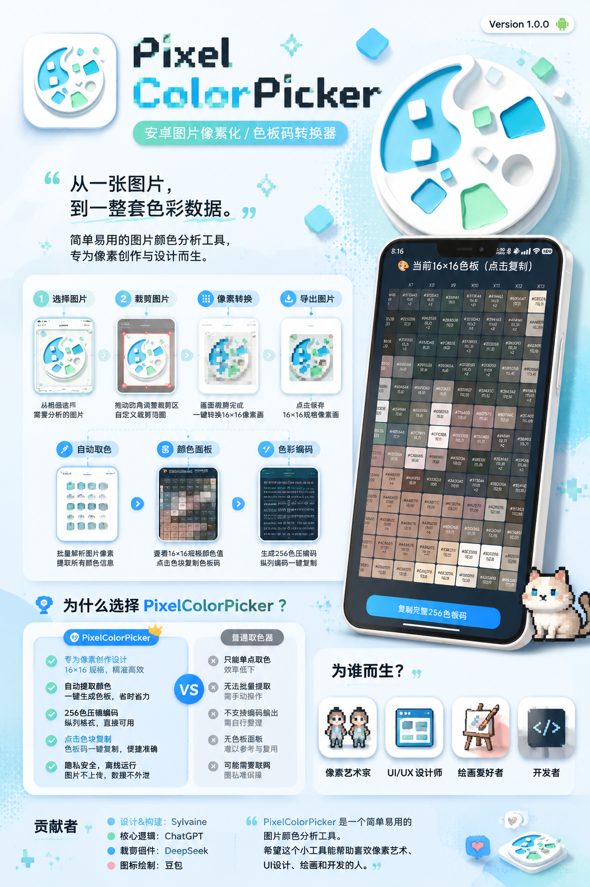
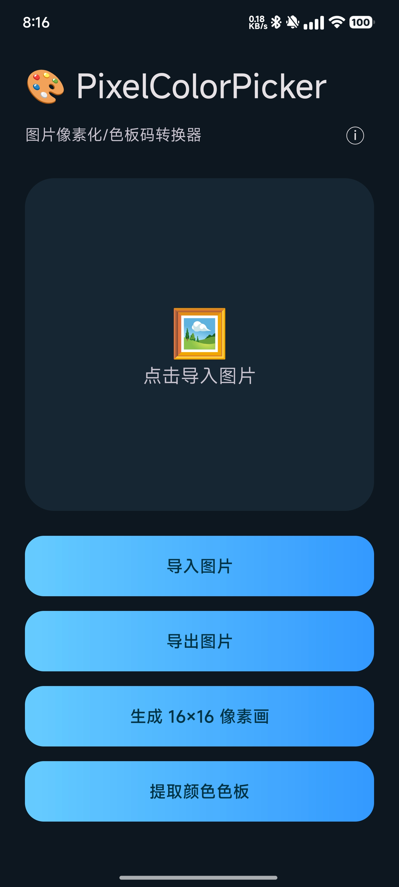
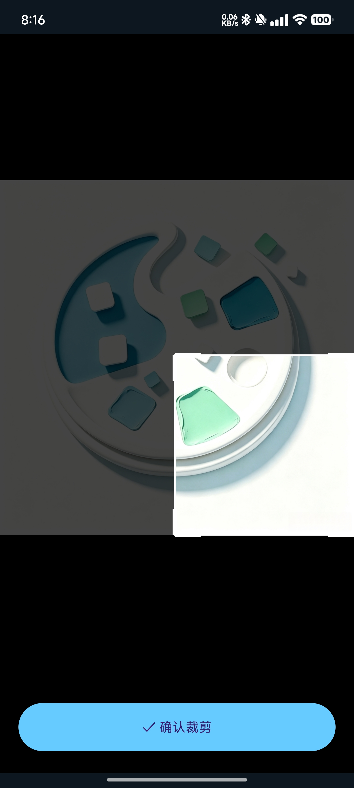
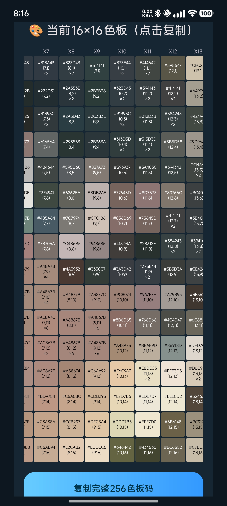

<p align="center">
  
</p>

<h1 align="center">PixelColorPicker</h1>

<p align="center">
  Android Pixel Art & Palette Generator
</p>

<p align="center">
一款专为 16×16 像素图片制作与色板码生成而设计的 Android 工具。
</p>

<p align="center">


</p>

<p align="center">


</p>

<p align="center">


</p>

---

# ✨ Introduction

**PixelColorPicker** 是一款专门用于 **16×16 像素图片制作、颜色分析以及色板码生成** 的 Android 应用。

项目最初源于《像素射击》头像制作过程中繁琐的取色流程，希望通过自动化处理，大幅降低重复劳动，提高制作效率。

它能够帮助用户快速完成：

- 🖼️ 图片导入
- ✂️ 图片裁剪
- 🎨 16×16 像素化
- 🌈 自动颜色提取
- 📋 色板码生成
- 📤 一键复制导出

适用于：

- 🎮 游戏头像制作
- 🎨 Pixel Art 创作
- 🌈 图片颜色分析
- 🧩 16×16 像素设计

---

# 📑 Table of Contents

- [✨ Introduction](#-introduction)
- [🚀 Features](#-features)
- [📱 Screenshots](#-screenshots)
- [🎬 Demo Video](#-demo-video)
- [⚡ Workflow](#-workflow)
- [🛠 Technical Details](#-technical-details)
- [🌍 Multi-language](#-multi-language)
- [👨‍💻 Credits](#-credits)
- [📄 License](#-license)

---

# 🚀 Features

## 🖼️ Image Selection

- Select images from the gallery
- Supports common image formats

---

## ✂️ Free Crop

- Adjustable crop area
- Smooth dragging
- Faster crop performance (v1.0.1)

---

## 🎨 Pixel Conversion

- Convert images to 16×16 pixels
- Preserve the main visual appearance
- High-quality pixel sampling

---

## 🌈 Palette Extraction

- Analyze all 256 pixels
- Automatically extract colors
- Display complete color information

---

## 📋 Palette Code Export

- Generate palette codes automatically
- Copy 16-color columns with one tap
- Greatly improves production efficiency

---

## 🌍 Multi-language

Supported Languages:

- 🇨🇳 简体中文
- 🇺🇸 English
- 🇯🇵 日本語

---

# 📱 Screenshots

<p align="center">







</p>

---

# 🎬 Demo Video

Coming Soon...

---

# ⚡ Workflow

### Traditional Workflow

```
Image
   ↓
Manual Color Picking
   ↓
Record Colors
   ↓
Arrange Palette
   ↓
Import into Game
```

### PixelColorPicker Workflow

```
Image
   ↓
Automatic Analysis
   ↓
Generate 256 Colors
   ↓
Copy Palette Codes
   ↓
Done ✅
```

PixelColorPicker significantly reduces repetitive operations and improves efficiency.

---

# 🛠 Technical Details

- Java
- Android SDK
- Bitmap Processing
- Pixel Sampling Algorithm
- Palette Encoding
- Protobuf
- GZIP Compression

---

# 🌍 Multi-language

PixelColorPicker currently supports:

| Language | Status |
|-----------|--------|
| 简体中文 | ✅ |
| English | ✅ |
| 日本語 | ✅ |

More languages may be added in future versions.

---

# 🆕 What's New in v1.0.1

- ✨ Redesigned application interface
- 🌍 Added multilingual support
- ⚡ Improved image cropping performance
- 🎨 Optimized overall user experience

---

# 👨‍💻 Credits

### Design & Development

Astnote

### Core Algorithm Assistance

ChatGPT

### Crop Component Assistance

DeepSeek

### Icon Design

豆包

---

# ⭐ Star History

If you like this project, please consider giving it a **Star ⭐**.

It helps more people discover PixelColorPicker!

---

# 📄 License

This project is licensed under the **MIT License**.

---

<p align="center">

Made with ❤️ for Android & Pixel Art

<br><br>

<b>PixelColorPicker v1.0.1</b>

</p>