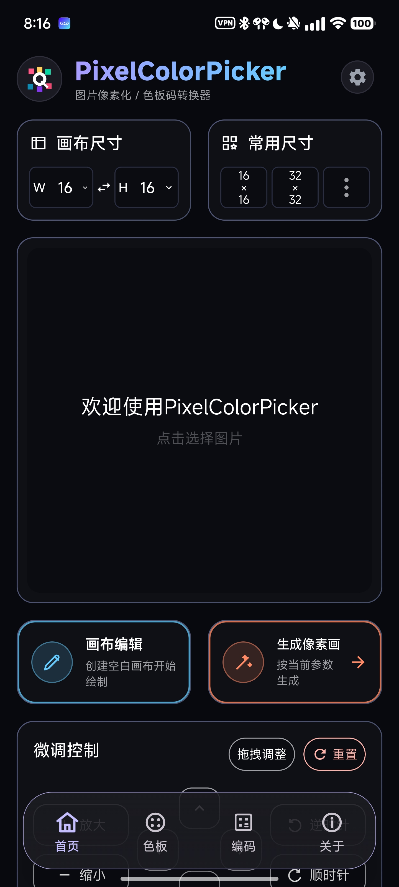
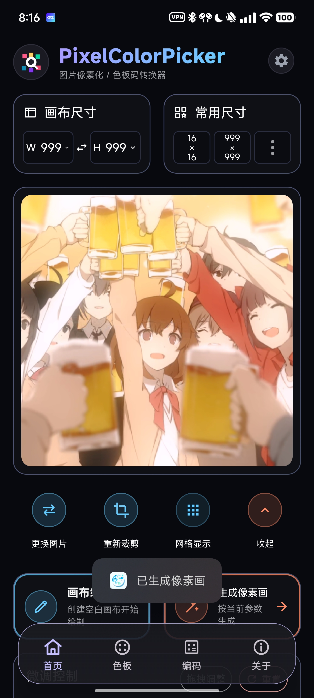
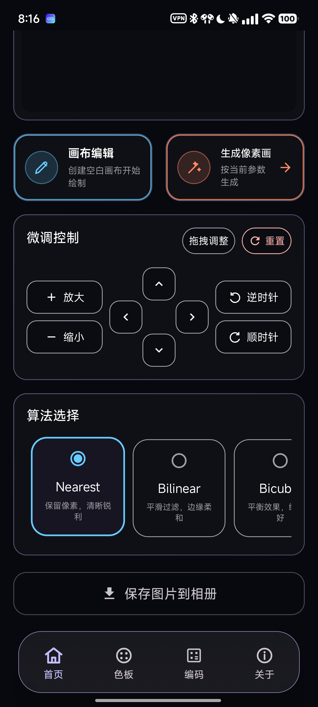
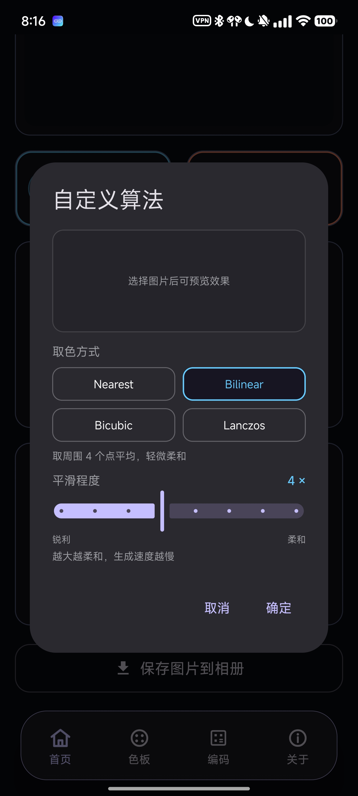
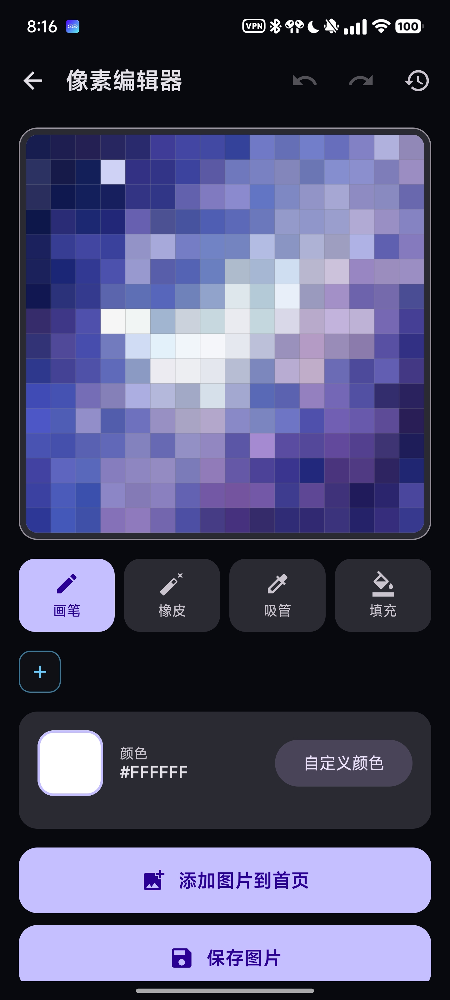
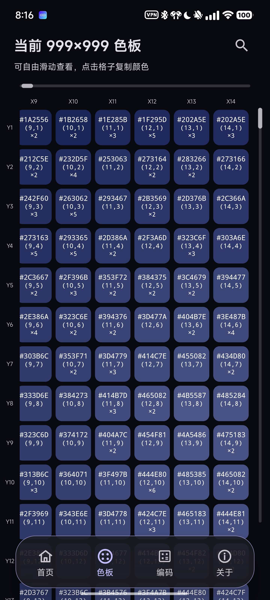
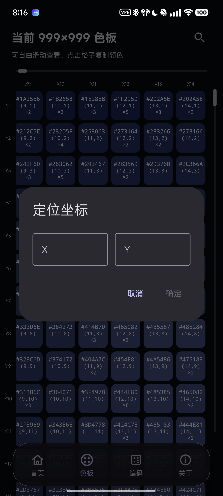
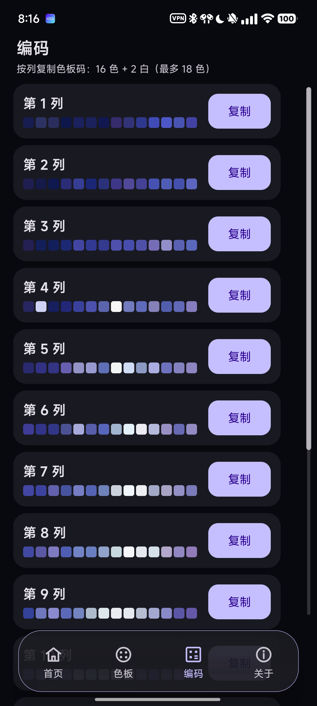
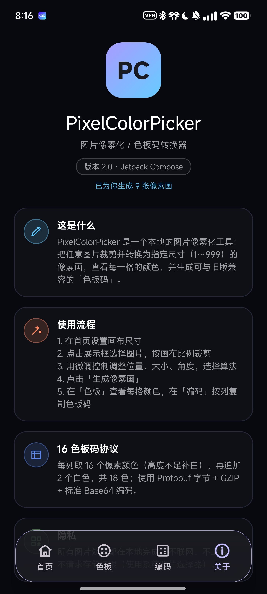
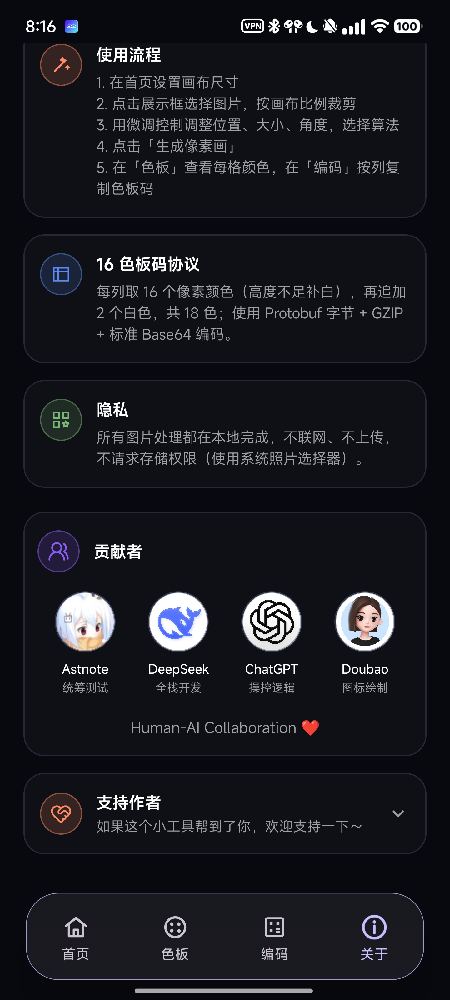

<div align="center">


# PixelColorPicker

**把任意图片变成像素画 · 逐格取色 · 生成色板码**

[](https://github.com/YYGYLTY/PixelColorPicker/releases/latest)
[](#-下载安装)
[](#-从源码构建)
[](#-从源码构建)
[](#-许可)

[**⬇️ 下载最新版 APK**](https://github.com/YYGYLTY/PixelColorPicker/releases/latest) · [更新日志](CHANGELOG.md) · [开发文档](DEVELOPMENT.md)

[功能一览](#-功能一览) · [算法详解](#-算法详解) · [使用流程](#-使用流程) · [下载安装](#-下载安装) · [从源码构建](#-从源码构建) · [致谢](#-致谢)

**⚡ v2.0 亮点**：大画布提速 **9 倍** · **自定义算法**（实时预览）· 全新界面与开场动效 · 拖拽调整 · 历史记录 · 检查更新

</div>

---

## 📖 这是什么

**PixelColorPicker** 是一个 **本地、离线、无广告** 的图片像素化工具：

> 选一张图 → 裁成画布比例 → 生成像素画 → 逐格查看颜色 / 复制色板码

本仓库是 **v2.0 Compose 重制版**（Kotlin + Jetpack Compose + Material 3）。
旧版 Java 源码保留在 [`v1.0.1`](https://github.com/YYGYLTY/PixelColorPicker/tree/v1.0.1) 标签中，随时可查阅。

---

## 📸 界面预览

<table>
  <tr>
    <td align="center" width="33%"><br><sub>首页 · 开场动画</sub></td>
    <td align="center" width="33%"><br><sub>生成像素画</sub></td>
    <td align="center" width="33%"><br><sub>微调控制与算法选择</sub></td>
  </tr>
  <tr>
    <td align="center"><br><sub>自定义算法（实时预览）</sub></td>
    <td align="center"><br><sub>像素编辑器</sub></td>
    <td align="center"><br><sub>色板（HEX / 坐标 / 同色计数）</sub></td>
  </tr>
  <tr>
    <td align="center"><br><sub>按坐标定位</sub></td>
    <td align="center"><br><sub>编码（按列复制色板码）</sub></td>
    <td align="center"><br><sub>关于</sub></td>
  </tr>
</table>

---

## ✨ 功能一览

### 🖼 图片 → 像素画
- 画布尺寸 **1 ~ 999** 任意设置，内置常用预设
- 按画布比例**裁剪**：拖拽移动、双指缩放、四角 / 四边调整
- **微调控制**：放大 / 缩小 / 四向平移 / 顺逆时针旋转 / 重置 / **拖拽调整**（在展示框内直接拖动、双指捏合）
- **5 种重采样算法 + 自定义算法**（取色方式 × 平滑程度，带实时效果预览）

| 算法 | 特点 |
|---|---|
| **最近邻** | 最锐利、颗粒感强（默认） |
| **双线性** | 轻微柔和，通用均衡 |
| **双三次** | 平滑自然，照片质感 |
| **Lanczos** | 细节保留最好 |
| **区域平均** | 最柔和、噪点最少 |

### 🎨 查看与使用
- **色板页**：双向自由滚动网格，显示 HEX / 坐标 / 同色计数，点击复制；支持按坐标**定位查找**
- **编码页**：按列复制「18 色板码」，与旧版 `PaletteExporter` **逐字节兼容**
- 保存 W×H PNG 到相册（整数倍最近邻放大，保持像素锐利）

### ✏️ 空白画布编辑器
- 任意尺寸新建；画笔 / 橡皮 / 吸管 / 填充 / 撤销 / 重做 / 清空
- 作品保存到**历史记录**，随时载入继续编辑

### 🌏 体验
- 中文 / English / 日本語
- 深色 / 浅色主题（跟随系统，可手动切换）
- **检查更新** + 本地使用统计（仅存本机，不上传）
- 无网络权限、无广告、无多余权限（图片选择使用系统照片选择器）

---

## 🔬 算法详解

像素化的本质是 **重采样（resampling）**：每个目标格子对应源图上的一块区域，程序在区域内**取样**、按**核函数**加权平均，得到该格颜色。取多少个点、怎么加权，直接决定成品的锐利程度与平滑程度。

<table>
  <tr>
    <td align="center" width="50%"><br><sub>首页 · 小画布（16×16）</sub></td>
    <td align="center" width="50%"><br><sub>首页 · 大画布（999×999）</sub></td>
  </tr>
</table>

<p align="center">
  <br>
  <sub>自定义算法面板：取色方式 × 平滑程度，实时预览</sub>
</p>

### 📐 五种内置算法

| 算法 | 核函数 / 采样方式 | 采样点数 | 特性 | 适合 |
|---|---|---|---|---|
| **最近邻** Nearest | 点采样（box） | 1×1 = 1 | 边缘绝对锐利、颗粒感强，**不会产生新颜色** | 像素画 / 需保留原图色板（默认） |
| **双线性** Bilinear | 三角滤波，可分离 2×2 | 2×2 = 4 | 轻微柔化，速度快 | 通用、快速预览 |
| **双三次** Bicubic | Catmull-Rom 三次卷积（a = −0.5） | 4×4 = 16 | 平滑自然、细节保留好，略带锐化 | 照片质感 |
| **Lanczos** | 窗化 sinc（a = 2） | 4×4 = 16 | 细节保留最好，硬边缘可能有轻微振铃 | 高保真缩略 |
| **区域平均** Average | 双线性核 + 密集采样 | 最多 6×6 = 36 | 按覆盖面积平均，噪点 / 摩尔纹最少 | 大幅缩小、去噪 |

> 表中的采样点数是**上限**。程序会根据每个格子在源图上的**实际覆盖范围自适应**取样：
> 覆盖 1.6 px 时只取 2×2 个点，而不是固定 36 个 —— 这正是 999×999 大画布能**提速约 9 倍**的关键。

### 🎛 自定义算法

把「取色方式」和「平滑程度」拆开给你自由组合：

- **取色方式**（核函数）：最近邻 / 双线性 / 双三次 / Lanczos
- **平滑程度**（采样密度）：1× ~ 8×，数值越大越柔和、速度越慢
- 面板内提供 **实时预览**（最长边 96 px 快速渲染），改一个参数立刻看到差别
- 与内置算法不同，自定义算法**严格按你设定的密度采样**，所以滑块效果真实可感

### ⚙️ 实现要点

- **格中心映射**：目标格中心反变换回源图坐标（支持缩放 / 平移 / 旋转），与 `createScaledBitmap` 的采样中心一致
- **可分离加权**：双线性 / 双三次 / Lanczos 按 X、Y 方向分别求权重，权重存为局部变量、**零数组分配**
- **Alpha 通道同样参与加权**，透明图不会出现黑边
- **同色计数在后台线程统计**（色板 ×N），不阻塞像素画显示
- **预览结果复用**：生成后进入画布编辑直接命中缓存，秒开

### 💡 怎么选

| 需求 | 推荐 |
|---|---|
| 像素画 / 像素艺术 | **最近邻** |
| 快速看一眼效果 | 双线性 |
| 照片转像素画 | 双三次 / Lanczos |
| 大幅缩小、要干净 | 区域平均 |
| 想自己调 | **自定义**（4 内核 × 1~8× 平滑） |

---

## 🧭 使用流程

1. 在首页设置**画布尺寸**（1~999，或点「常用尺寸」快速选择）
2. 点击展示框**选择图片** → 按画布比例裁剪
3. 用**微调控制**调整位置 / 大小 / 角度，选择**算法**（或自定义算法）
4. 点击「**生成像素画**」
5. 在「**色板**」查看每一格颜色（点击复制），在「**编码**」按列复制色板码

> 也可以点「画布编辑」从空白画布开始手绘，完成后保存到相册或历史记录。

---

## 📱 下载安装

1. 前往 [**Releases**](https://github.com/YYGYLTY/PixelColorPicker/releases/latest) 下载最新 APK
2. 安装时按提示允许「安装未知来源应用」

- 支持 **Android 7.0（API 24）** 及以上
- ⚠️ 当前使用 debug 签名（与测试版保持覆盖安装兼容）；如需上架应用商店请换成正式签名

---

## 🛠 从源码构建

```bash
# 环境：JDK 17+、Android SDK（compileSdk 37）
./gradlew :app:assembleRelease
# 产物：app/build/outputs/apk/release/app-release.apk
```

<details>
<summary><b>技术栈与实现要点</b></summary>

- Kotlin 2.3 / AGP 9.0 / Jetpack Compose（BOM 2026.01.01）+ Material 3，单 Activity
- 自研像素化引擎：自适应超采样 + 核函数插值（最近邻 / 双线性 / 双三次 / Lanczos / 区域平均）
- 大画布优化：预览结果复用、采样密度自适应、同色计数后台计算
- 色板网格虚拟化绘制（滚动占位 + 可视区 Canvas），999×999 依然流畅
- 无第三方网络库；更新检查仅请求一个静态 JSON

</details>

---

## 📂 项目结构

```
com.pixelcolorpicker
├── MainActivity.kt          # 导航（Tab + 全屏子页）、语言、图片选择
├── codec/PaletteCodec.kt    # 18 色板码协议（纯 Kotlin，含单元测试）
├── image/
│   ├── BitmapLoader.kt      # 加载 / EXIF / 采样
│   └── Pixelator.kt         # 像素化引擎（5 算法 + 自定义 + 变换采样）
├── model/PixelArt.kt        # 可编辑画布（撤销 / 重做）+ PixelGrid
├── ui/                      # 首页 / 裁剪 / 编辑器 / 色板 / 编码 / 关于 / 设置
│   └── theme/               # 配色、主题、发光边框修饰符
└── util/                    # PNG 导出 / 颜色工具 / 语言 / 更新检查
```

---

## 📄 更新日志

见 [**CHANGELOG.md**](CHANGELOG.md)

---

## ⭐ Star History

[](https://star-history.com/#YYGYLTY/PixelColorPicker&Date)

---

## 🙏 致谢

| 贡献者 | 分工 |
|---|---|
| **Astnote** | 统筹 · 测试 |
| **DeepSeek** | 全栈开发 |
| **ChatGPT** | 操控逻辑 |
| **Doubao** | 图标绘制 |

由 **Astnote** 与 AI 协作完成的产品重制 ❤️

<p align="center">
  
</p>

---

## 📃 许可

本项目基于 **MIT License** 开源。

---

<div align="center">

如果这个项目帮到了你，欢迎点个 **Star** ⭐

</div>
